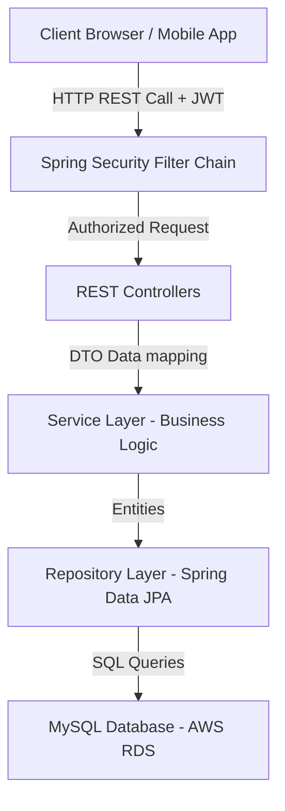

# 🌸 HerCycle Backend

[](#) [](#) [](#) [](#) [](#)

HerCycle is a comprehensive, feature-rich women's health platform. This repository contains the professional-grade backend REST API service built with **Spring Boot** and **MySQL (hosted on AWS RDS)**. It features full role-based JWT authentication, a menstrual cycle and fertility tracking analytics engine, shopping & checkout capabilities, partner integration, medicine reminders, symptom logs, water tracking, and an administrative dashboard.

## 🚀 Features
- **User Authentication (JWT)**: Secure user sign-up, login, stateful token refresh, and logout utilizing Bearer JWT.
- **User Profile Management**: Complete weight, height, age, blood group, notifications preference, and status configurations.
- **Period Tracking & Logging**: Record menstrual start/end dates, flow density, cycle parameters, and notes.
- **Ovulation & Fertility Calculations**: Automatically predict next period dates, ovulation days, fertility windows, and safe days.
- **Medicine Reminders**: Set, list, delete, and check off medicine dosages with scheduled times and daily frequency.
- **Water Intake Tracking**: Manage daily water intake metrics and auto-reset logs on a new calendar date.
- **Symptoms Tracking**: Detailed logging of symptoms (cramps, bloating, pain, acne, mood patterns, sleep, and energy levels).
- **Notifications**: Internal notification manager notifying users of late periods, scheduled reminders, and partner invites.
- **Partner Invitation & Sharing**: Invite partner email, accept/reject invitations, and securely share self-care/health logs.
- **Self Care Module**: Informative video catalog, YouTube link integration, self-care category views, and video bookmarks.
- **Shopping Module**: E-commerce catalog viewing, search filtering, cart modifications, address records, and checkout.
- **Wishlist & Cart**: Personal items shopping carts and wishlists directly tied to user RDS database states.
- **Orders & Checkout**: Secure placement of orders with payment details (COD), discount coupons, and delivery status updates.
- **Feedback**: User platform rating and feedback message submissions.
- **Admin Dashboard**: Rich system insights, statistics counters, order management, video publishing, and user tables.
- **Role-Based Security**: Method-level security blockades separating standard users from administrator dashboard paths.
- **OpenAPI Swagger UI**: Interactive API play sandbox available directly at runtime.

## 🛠️ Tech Stack
- **Core Framework**: Java 21, Spring Boot 3.2.5, Spring MVC
- **Security**: Spring Security, io.jsonwebtoken (JJWT 0.12.5)
- **Persistence Layer**: Spring Data JPA, Hibernate, MySQL Connector
- **Database**: MySQL (AWS RDS Cloud database instance)
- **Documentation**: Springdoc OpenAPI Swagger UI v2.5.0
- **Testing**: JUnit 5, Mockito, Spring Test MockMvc, Byte Buddy
- **Utilities**: Lombok, ModelMapper, Maven Wrapper

## 📂 Project Structure
```text
Backend/
├── .mvn/                     # Maven Wrapper configuration
├── src/
│   ├── main/
│   │   ├── java/com/hercycle/
│   │   │   ├── controller/   # REST Controllers (API request handlers)
│   │   │   ├── dto/          # Data Transfer Objects (Requests/Responses)
│   │   │   ├── entity/       # JPA Entities (Hibernate database model mapping)
│   │   │   ├── exception/    # Custom exceptions & global exception handler
│   │   │   ├── mapper/       # Entity-to-DTO ModelMapper logic
│   │   │   ├── repository/   # Spring Data JPA Repository Interfaces
│   │   │   ├── security/     # JWT configuration, filtering, WebSecurity
│   │   │   └── service/      # Service Layer (Business logic implementations)
│   │   └── resources/
│   │       ├── application.properties # Main Spring Boot properties
│   │       ├── schema.sql    # DDL queries for database initialization
│   │       └── sample_data.sql # Initial dataset for testing/development
│   └── test/                 # JUnit/Mockito integration & controller tests
├── Dockerfile                # Docker build description
├── docker-compose.yml        # Docker orchestration configuration
├── pom.xml                   # Maven build configuration and dependencies
└── README.md                 # Project documentation
```

## 🏛️ Architecture & Request Flow
The project follows a standard **n-tier architectural pattern** to maintain strict separation of concerns, scalability, and testability:



### Request Flow Details:
1. **Security Filter Chain**: Checks for incoming requests. Validates Bearer JWT header tokens using a customized filter. Intercepts endpoints based on roles (User vs. Admin).
2. **Controllers**: Exposes clean JSON API endpoint parameters, maps incoming request bodies to DTOs, and invokes service methods.
3. **Service Layer**: Implements business calculations (such as ovulation predictions, period statistics calculations, cart calculations, order placements, and partner invitation approvals).
4. **Repository Layer**: Extends `JpaRepository` to perform CRUD queries on the MySQL RDS cloud database.

## 🗄️ Database Schema & Entities
The database model consists of **14 tables** maintaining foreign key referential integrity with cascading deletes where appropriate. Below is the documentation extracted from [schema.sql](file:///c:/Users/vasav/OneDrive/Desktop/Her_Cycle/Backend/src/main/resources/schema.sql):

### Table: `users`
- **Primary Key**: `id`
- **Foreign Keys**: None
- **Important Columns**:
  `id` (BIGINT), `first_name` (VARCHAR(100)), `last_name` (VARCHAR(100)), `email` (VARCHAR(100)), `password` (VARCHAR(255)), `phone` (VARCHAR(30)), `date_of_birth` (DATE), `age` (INT), and 13 more...

### Table: `periods`
- **Primary Key**: `id`
- **Foreign Keys**: `user_id -> users(id)`
- **Important Columns**:
  `id` (BIGINT), `user_id` (BIGINT), `period_start_date` (DATE), `period_end_date` (DATE), `cycle_length` (INT), `period_length` (INT), `flow` (VARCHAR(30)), `notes` (TEXT), and 4 more...

### Table: `symptoms`
- **Primary Key**: `id`
- **Foreign Keys**: `user_id -> users(id)`
- **Important Columns**:
  `id` (BIGINT), `user_id` (BIGINT), `date` (DATE), `mood` (VARCHAR(30)), `pain` (INT), `cramps` (BOOLEAN), `headache` (BOOLEAN), `back_pain` (BOOLEAN), and 16 more...

### Table: `medicine_reminders`
- **Primary Key**: `id`
- **Foreign Keys**: `user_id -> users(id)`
- **Important Columns**:
  `id` (BIGINT), `user_id` (BIGINT), `medicine_name` (VARCHAR(100)), `dosage` (VARCHAR(50)), `time` (TIME), `frequency` (VARCHAR(50)), `start_date` (DATE), `end_date` (DATE), and 5 more...

### Table: `water_trackers`
- **Primary Key**: `id`
- **Foreign Keys**: `user_id -> users(id)`
- **Important Columns**:
  `id` (BIGINT), `user_id` (BIGINT), `goal` (DOUBLE), `completed` (DOUBLE), `date` (DATE), `created_at` (DATETIME), `updated_at` (DATETIME), `created_by` (VARCHAR(100)), and 1 more...

### Table: `self_care`
- **Primary Key**: `id`
- **Foreign Keys**: None
- **Important Columns**:
  `id` (BIGINT), `title` (VARCHAR(150)), `description` (TEXT), `category` (VARCHAR(50)), `thumbnail` (VARCHAR(255)), `youtube_url` (VARCHAR(255)), `created_at` (DATETIME), `updated_at` (DATETIME), and 2 more...

### Table: `video_bookmarks`
- **Primary Key**: `id`
- **Foreign Keys**: `user_id -> users(id)`, `video_id -> self_care(id)`
- **Important Columns**:
  `id` (BIGINT), `user_id` (BIGINT), `video_id` (BIGINT), `created_at` (DATETIME), `updated_at` (DATETIME), `created_by` (VARCHAR(100)), `updated_by` (VARCHAR(100))

### Table: `partners`
- **Primary Key**: `id`
- **Foreign Keys**: `user_id -> users(id)`
- **Important Columns**:
  `id` (BIGINT), `user_id` (BIGINT), `partner_email` (VARCHAR(100)), `status` (VARCHAR(30)), `invite_date` (DATETIME), `accepted_date` (DATETIME), `created_at` (DATETIME), `updated_at` (DATETIME), and 2 more...

### Table: `products`
- **Primary Key**: `id`
- **Foreign Keys**: None
- **Important Columns**:
  `id` (BIGINT), `name` (VARCHAR(150)), `description` (TEXT), `price` (DECIMAL(10), `discount` (DECIMAL(5), `stock` (INT), `rating` (DOUBLE), `reviews_count` (INT), and 7 more...

### Table: `coupons`
- **Primary Key**: `id`
- **Foreign Keys**: None
- **Important Columns**:
  `id` (BIGINT), `code` (VARCHAR(50)), `discount_amount` (DECIMAL(10), `discount_percentage` (DECIMAL(5), `expiry_date` (DATE), `is_active` (BOOLEAN), `created_at` (DATETIME), `updated_at` (DATETIME), and 2 more...

### Table: `cart_items`
- **Primary Key**: `id`
- **Foreign Keys**: `user_id -> users(id)`, `product_id -> products(id)`
- **Important Columns**:
  `id` (BIGINT), `user_id` (BIGINT), `product_id` (BIGINT), `quantity` (INT), `price` (DECIMAL(10), `subtotal` (DECIMAL(10), `created_at` (DATETIME), `updated_at` (DATETIME), and 2 more...

### Table: `wishlist_items`
- **Primary Key**: `id`
- **Foreign Keys**: `user_id -> users(id)`, `product_id -> products(id)`
- **Important Columns**:
  `id` (BIGINT), `user_id` (BIGINT), `product_id` (BIGINT), `created_at` (DATETIME), `updated_at` (DATETIME), `created_by` (VARCHAR(100)), `updated_by` (VARCHAR(100))

### Table: `addresses`
- **Primary Key**: `id`
- **Foreign Keys**: `user_id -> users(id)`
- **Important Columns**:
  `id` (BIGINT), `user_id` (BIGINT), `full_name` (VARCHAR(100)), `phone` (VARCHAR(30)), `house_no` (VARCHAR(50)), `street` (VARCHAR(150)), `city` (VARCHAR(100)), `district` (VARCHAR(100)), and 8 more...

### Table: `orders`
- **Primary Key**: `id`
- **Foreign Keys**: `user_id -> users(id)`, `address_id -> addresses(id)`, `coupon_id -> coupons(id)`
- **Important Columns**:
  `id` (BIGINT), `order_number` (VARCHAR(100)), `user_id` (BIGINT), `address_id` (BIGINT), `payment_method` (VARCHAR(50)), `payment_status` (VARCHAR(50)), `order_status` (VARCHAR(50)), `delivery_status` (VARCHAR(50)), and 9 more...

### Table: `order_items`
- **Primary Key**: `id`
- **Foreign Keys**: `order_id -> orders(id)`, `product_id -> products(id)`
- **Important Columns**:
  `id` (BIGINT), `order_id` (BIGINT), `product_id` (BIGINT), `quantity` (INT), `price` (DECIMAL(10), `subtotal` (DECIMAL(10), `created_at` (DATETIME), `updated_at` (DATETIME), and 2 more...

### Table: `notifications`
- **Primary Key**: `id`
- **Foreign Keys**: `user_id -> users(id)`
- **Important Columns**:
  `id` (BIGINT), `user_id` (BIGINT), `title` (VARCHAR(150)), `message` (TEXT), `type` (VARCHAR(50)), `scheduled_time` (DATETIME), `is_read` (BOOLEAN), `created_at` (DATETIME), and 3 more...

### Table: `feedbacks`
- **Primary Key**: `id`
- **Foreign Keys**: `user_id -> users(id)`
- **Important Columns**:
  `id` (BIGINT), `user_id` (BIGINT), `rating` (INT), `message` (TEXT), `created_at` (DATETIME), `updated_at` (DATETIME), `created_by` (VARCHAR(100)), `updated_by` (VARCHAR(100))

### Entity-Relationship Map
The relational linkages are mapped as follows:

- **One-to-Many**:
  - `users` (1) ── (N) `periods` (Cascade Delete)
  - `users` (1) ── (N) `symptoms` (Cascade Delete)
  - `users` (1) ── (N) `medicine_reminders` (Cascade Delete)
  - `users` (1) ── (N) `water_trackers` (Cascade Delete)
  - `users` (1) ── (N) `partners` (Cascade Delete)
  - `users` (1) ── (N) `cart_items` (Cascade Delete)
  - `users` (1) ── (N) `wishlist_items` (Cascade Delete)
  - `users` (1) ── (N) `addresses` (Cascade Delete)
  - `users` (1) ── (N) `orders` (Cascade Delete)
  - `users` (1) ── (N) `notifications` (Cascade Delete)
  - `users` (1) ── (N) `feedbacks` (Cascade Delete)
  - `products` (1) ── (N) `cart_items` / `wishlist_items` (Cascade Delete)
  - `orders` (1) ── (N) `order_items` (Cascade Delete)
  - `self_care` (1) ── (N) `video_bookmarks` (Cascade Delete)
- **Many-to-One**:
  - `orders` ── `addresses` (Address link remains on order history)
  - `orders` ── `coupons` (Coupon link for orders discount tracker)


## 🔌 API Documentation
The HerCycle backend exposes **87 REST API endpoints**.

### AdminDashboardController
| Method | Endpoint URL | Description | Auth Required |
|---|---|---|---|
| `GET` | `/api/admin/dashboard/stats` | None handler | 🔒 Yes |
| `GET` | `/api/admin/users` | None handler | 🔒 Yes |

### AnalysisController
| Method | Endpoint URL | Description | Auth Required |
|---|---|---|---|
| `GET` | `/api/analysis` | None handler | 🔒 Yes |

### AuthController
| Method | Endpoint URL | Description | Auth Required |
|---|---|---|---|
| `POST` | `/api/auth/change-password` | ChangePasswordRequest handler | 🔒 Yes |
| `POST` | `/api/auth/forgot-password` | ForgotPasswordRequest handler | 🔓 No |
| `POST` | `/api/auth/login` | LoginRequest handler | 🔓 No |
| `POST` | `/api/auth/logout` | None handler | 🔒 Yes |
| `POST` | `/api/auth/refresh-token` | RefreshTokenRequest handler | 🔓 No |
| `POST` | `/api/auth/register` | RegisterRequest handler | 🔓 No |
| `POST` | `/api/auth/reset-password` | ResetPasswordRequest handler | 🔓 No |

### FeedbackController
| Method | Endpoint URL | Description | Auth Required |
|---|---|---|---|
| `GET` | `/api/admin/feedback` | None handler | 🔒 Yes |
| `POST` | `/api/feedback` | FeedbackRequest handler | 🔒 Yes |

### HealthController
| Method | Endpoint URL | Description | Auth Required |
|---|---|---|---|
| `GET` | `/api/health` | None handler | 🔓 No |

### NotificationController
| Method | Endpoint URL | Description | Auth Required |
|---|---|---|---|
| `GET` | `/api/notifications` | None handler | 🔒 Yes |
| `PUT` | `/api/notifications/{id}/read` | None handler | 🔒 Yes |

### OrderController
| Method | Endpoint URL | Description | Auth Required |
|---|---|---|---|
| `GET` | `/api/admin/orders` | None handler | 🔒 Yes |
| `PUT` | `/api/admin/orders/{id}/status` | None handler | 🔒 Yes |
| `GET` | `/api/orders` | None handler | 🔒 Yes |
| `POST` | `/api/orders` | OrderRequest handler | 🔒 Yes |
| `GET` | `/api/orders/{id}` | None handler | 🔒 Yes |
| `PUT` | `/api/orders/{id}/cancel` | None handler | 🔒 Yes |

### PartnerController
| Method | Endpoint URL | Description | Auth Required |
|---|---|---|---|
| `DELETE` | `/api/partner` | None handler | 🔒 Yes |
| `GET` | `/api/partner` | None handler | 🔒 Yes |
| `PUT` | `/api/partner/accept` | None handler | 🔒 Yes |
| `POST` | `/api/partner/invite` | PartnerRequest handler | 🔒 Yes |
| `PUT` | `/api/partner/reject` | None handler | 🔒 Yes |

### PeriodController
| Method | Endpoint URL | Description | Auth Required |
|---|---|---|---|
| `POST` | `/api/period` | PeriodRequest handler | 🔒 Yes |
| `GET` | `/api/period/calendar` | None handler | 🔒 Yes |
| `GET` | `/api/period/current` | None handler | 🔒 Yes |
| `GET` | `/api/period/fertility` | None handler | 🔒 Yes |
| `GET` | `/api/period/history` | None handler | 🔒 Yes |
| `GET` | `/api/period/is-irregular` | None handler | 🔒 Yes |
| `GET` | `/api/period/is-late` | None handler | 🔒 Yes |
| `GET` | `/api/period/next` | None handler | 🔒 Yes |
| `GET` | `/api/period/ovulation` | None handler | 🔒 Yes |
| `GET` | `/api/period/regularity-score` | None handler | 🔒 Yes |
| `GET` | `/api/period/safe-days` | None handler | 🔒 Yes |
| `GET` | `/api/period/today` | None handler | 🔒 Yes |
| `DELETE` | `/api/period/{id}` | None handler | 🔒 Yes |
| `PUT` | `/api/period/{id}` | PeriodRequest handler | 🔒 Yes |

### ReminderController
| Method | Endpoint URL | Description | Auth Required |
|---|---|---|---|
| `GET` | `/api/medicine-reminders` | None handler | 🔒 Yes |
| `POST` | `/api/medicine-reminders` | MedicineRequest handler | 🔒 Yes |
| `DELETE` | `/api/medicine-reminders/{id}` | None handler | 🔒 Yes |
| `PUT` | `/api/medicine-reminders/{id}` | MedicineRequest handler | 🔒 Yes |
| `PUT` | `/api/medicine-reminders/{id}/complete` | None handler | 🔒 Yes |
| `POST` | `/api/water/add` | None handler | 🔒 Yes |
| `PUT` | `/api/water/goal` | None handler | 🔒 Yes |
| `GET` | `/api/water/history` | None handler | 🔒 Yes |
| `GET` | `/api/water/today` | None handler | 🔒 Yes |

### SelfCareController
| Method | Endpoint URL | Description | Auth Required |
|---|---|---|---|
| `POST` | `/api/admin/self-care` | VideoRequest handler | 🔒 Yes |
| `DELETE` | `/api/admin/self-care/{id}` | None handler | 🔒 Yes |
| `PUT` | `/api/admin/self-care/{id}` | VideoRequest handler | 🔒 Yes |
| `GET` | `/api/self-care` | None handler | 🔓 No |
| `DELETE` | `/api/self-care/bookmark/{videoId}` | None handler | 🔓 No |
| `POST` | `/api/self-care/bookmark/{videoId}` | None handler | 🔓 No |
| `GET` | `/api/self-care/bookmarks` | None handler | 🔓 No |
| `GET` | `/api/self-care/category/{category}` | None handler | 🔓 No |
| `GET` | `/api/self-care/search` | None handler | 🔓 No |

### ShopController
| Method | Endpoint URL | Description | Auth Required |
|---|---|---|---|
| `GET` | `/api/addresses` | None handler | 🔒 Yes |
| `POST` | `/api/addresses` | AddressRequest handler | 🔒 Yes |
| `DELETE` | `/api/addresses/{id}` | None handler | 🔒 Yes |
| `PUT` | `/api/addresses/{id}` | AddressRequest handler | 🔒 Yes |
| `POST` | `/api/admin/products` | ProductRequest handler | 🔒 Yes |
| `DELETE` | `/api/admin/products/{id}` | None handler | 🔒 Yes |
| `PUT` | `/api/admin/products/{id}` | ProductRequest handler | 🔒 Yes |
| `POST` | `/api/admin/products/{id}/image` | None handler | 🔒 Yes |
| `PUT` | `/api/admin/products/{id}/stock` | None handler | 🔒 Yes |
| `DELETE` | `/api/cart` | None handler | 🔒 Yes |
| `GET` | `/api/cart` | None handler | 🔒 Yes |
| `POST` | `/api/cart` | CartRequest handler | 🔒 Yes |
| `DELETE` | `/api/cart/{id}` | None handler | 🔒 Yes |
| `PUT` | `/api/cart/{id}` | None handler | 🔒 Yes |
| `GET` | `/api/products` | None handler | 🔓 No |
| `GET` | `/api/products/filter` | None handler | 🔓 No |
| `GET` | `/api/products/search` | None handler | 🔓 No |
| `GET` | `/api/products/{id}` | None handler | 🔓 No |
| `GET` | `/api/wishlist` | None handler | 🔒 Yes |
| `POST` | `/api/wishlist` | None handler | 🔒 Yes |
| `DELETE` | `/api/wishlist/{productId}` | None handler | 🔒 Yes |

### SymptomController
| Method | Endpoint URL | Description | Auth Required |
|---|---|---|---|
| `GET` | `/api/symptoms` | None handler | 🔒 Yes |
| `POST` | `/api/symptoms` | SymptomRequest handler | 🔒 Yes |
| `GET` | `/api/symptoms/history` | None handler | 🔒 Yes |
| `DELETE` | `/api/symptoms/{id}` | None handler | 🔒 Yes |
| `PUT` | `/api/symptoms/{id}` | SymptomRequest handler | 🔒 Yes |

### UserController
| Method | Endpoint URL | Description | Auth Required |
|---|---|---|---|
| `DELETE` | `/api/users/profile` | None handler | 🔒 Yes |
| `GET` | `/api/users/profile` | None handler | 🔒 Yes |
| `PUT` | `/api/users/profile` | UserProfileRequest handler | 🔒 Yes |

## 🔐 Authentication & Authorization

All protected endpoints utilize **Bearer JSON Web Tokens (JWT)**:
1. **Registration**: User posts details to `/api/auth/register` (unauthenticated). Defaults role to `ROLE_USER`.
2. **Login**: User posts details to `/api/auth/login` (unauthenticated). Returns:
   - `token` (Access JWT token - 24 hours expiry)
   - `refreshToken` (Refresh token - 7 days expiry)
   - `role` (e.g. `ROLE_USER` or `ROLE_ADMIN`)
3. **Bearer Authorization**: Client includes token in request header: `Authorization: Bearer <jwt_access_token>`.
4. **Token Refresh**: Client posts `refreshToken` to `/api/auth/refresh-token` to retrieve a fresh access token without re-authenticating.
5. **Role Restrictions**: Spring security blocks administrative URLs (`/api/admin/**`) strictly forcing `hasRole('ADMIN')` access privileges.


## 🚀 Installation & Local Running

### Prerequisites:
- Java JDK 21+
- Maven 3.8+
- MySQL Server 8.0+

### Step-by-Step Guide:
1. Clone the repository:
   ```bash
   git clone https://github.com/HerCycle/backend.git
   cd backend
   ```
2. Build the project using Maven Wrapper:
   ```bash
   ./mvnw clean install
   ```
3. Run the Spring Boot application:
   ```bash
   ./mvnw spring-boot:run
   ```


## ⚙️ Configuration (`application.properties`)
Create or edit `src/main/resources/application.properties` with database connection settings:
```properties
# Server Port
server.port=8080

# AWS RDS / Local MySQL Configuration
spring.datasource.url=jdbc:mysql://<your-db-endpoint>:3306/hercycle?createDatabaseIfNotExist=true
spring.datasource.username=<your-username>
spring.datasource.password=<your-password>
spring.datasource.driver-class-name=com.mysql.cj.jdbc.Driver

# JPA Config
spring.jpa.hibernate.ddl-auto=update
spring.jpa.show-sql=true

# JWT Secrets Config
hercycle.jwt.secret=<your-32-byte-hexadecimal-jwt-secret-key>
hercycle.jwt.expiration=86400000
hercycle.jwt.refreshExpiration=604800000
```

## 🐳 Running with Docker

To spin up both the Spring Boot app container and a local MySQL server container automatically, use the configured `docker-compose.yml`:
1. Build the Docker image locally:
   ```bash
   docker compose build
   ```
2. Start the services:
   ```bash
   docker compose up -d
   ```
The application will start listening on port `8080` container port forwarded locally.


## 🔍 Swagger & API Playground
- **Swagger UI URL**:http://52-2-37-31.sslip.io/swagger-ui/index.html
- **OpenAPI Schema Docs**:http://52-2-37-31.sslip.io/v3/api-docs

## 📬 Postman Collection
- The Postman test catalog is exported directly in the root folder: [hercycle_postman_collection.json](file:///c:/Users/vasav/OneDrive/Desktop/Her_Cycle/Backend/hercycle_postman_collection.json).
- Import this file directly into Postman to play request variables, header settings, and verify responses.

## 🧪 Automated Testing & Coverage Suite

HerCycle features a comprehensive integration testing suite asserting both REST API HTTP statuses and RDS database state updates:
- **Total REST Endpoints**: 87
- **API Endpoint Coverage**: **100% (87/87 Endpoints)**
- **Test Suite Pass Rate**: **100% (37/37 tests passed)**
- **Testing Tools**: JUnit 5, Spring Test MockMvc, Mockito, Byte Buddy

Run the test suite:
```bash
./mvnw test
```


## 🔮 Future Improvements

- **Machine Learning Integration**: Introduce neural network model triggers to accurately predict irregular cycles based on log histories.
- **Stateful JWT Revocation**: Configure Redis cache layers to track blacklisted logout tokens.
- **Push Notifications Integration**: Set up Firebase Cloud Messaging (FCM) to trigger mobile notifications on period dates and drug alert slots.


## 🤝 Contributing
We welcome community contributions. Please open issues, propose pull requests, and maintain clean coding conventions in accordance with existing RESTful specifications.

## 📄 License
This project is licensed under the MIT License. See LICENSE for details.
