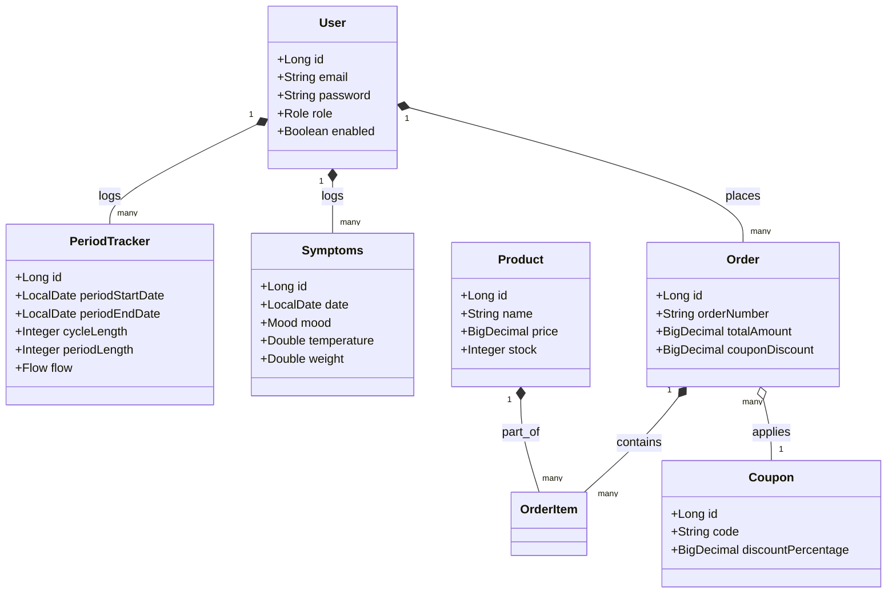

# HerCycle Backend - Enterprise Women's Health Platform

HerCycle is an enterprise-grade production-ready Java 21 & Spring Boot 3.x backend for Women's Health tracking, cycle predictions, safe days calculations, daily habits log (water/sleep/medicine), self-care video bookmarks, and an organic sanitary care e-commerce catalog checkout.

---

## Use Case Diagram

```mermaid
usecaseDiagram
    actor User as "Standard User"
    actor Admin as "System Admin"
    
    User --> (Register / Log in)
    User --> (Track Menstrual Cycle & Prediction)
    User --> (Log Physical Symptoms & Moods)
    User --> (Shop Organic Care Products)
    User --> (Manage Cart & Checkout Coupons)
    User --> (Invite Partner & Share Logs)
    User --> (Receive In-App Notifications)
    
    Admin --> (Manage Store Products & Stock)
    Admin --> (Upload Self-Care Content)
    Admin --> (Update Order Shipping Status)
    Admin --> (View Site Revenue Statistics)
```

---

## Class Diagram



---

## Technical Highlights
- **JPA Auditing Mapped Superclass**: Automatic injection of metadata auditing trackers (`createdAt`, `updatedAt`, `createdBy`, `updatedBy`).
- **N+1 Query Resolution**: Heavy endpoints optimized using JPQL `JOIN FETCH` queries.
- **Cycle Regularity Standard Deviation Score**: Custom arithmetic regularity indexing.
- **Store Checkout Discount Promotion Codes**: Handles coupons, inventory validation checks, and quantity deductions.

---

## Database Configuration

Configurations reside in `src/main/resources/application.properties` pointing to:
- **Engine**: MySQL 8
- **RDS Host**: `hercycle.cczkqckgorra.us-east-1.rds.amazonaws.com`
- **Username**: `admin`
- **Password**: `hercycle123`
- **Database**: `hercycle`

### Data Initializer Script
- The [schema.sql](file:///c:/Users/vasav/OneDrive/Desktop/Her_Cycle/Backend/src/main/resources/schema.sql) defines the tables structure and performance indices.
- The [sample_data.sql](file:///c:/Users/vasav/OneDrive/Desktop/Her_Cycle/Backend/src/main/resources/sample_data.sql) contains default seed logins:
  - **Standard User**: `user@hercycle.com` / password: `password123`
  - **System Admin**: `admin@hercycle.com` / password: `password123`

---

## Deployment & Setup Guide

### 1. Compile and Test Suite
```bash
mvn clean test
```

### 2. Startup Application
```bash
mvn spring-boot:run
```

- Swagger Catalog: `http://localhost:8080/swagger-ui/index.html`
- Postman Collection: Import `hercycle_postman_collection.json` from the root directory, authenticate to retrieve the bearer token, and configure it under variables.
