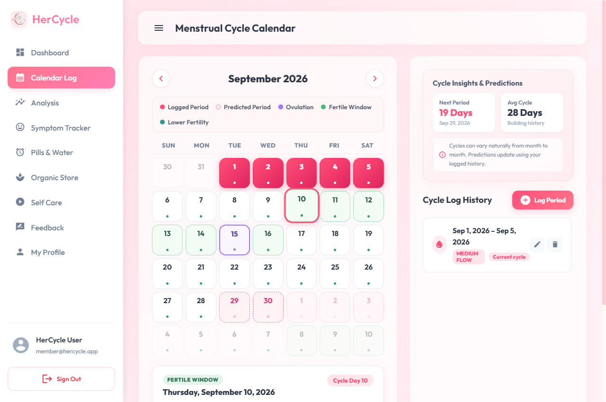
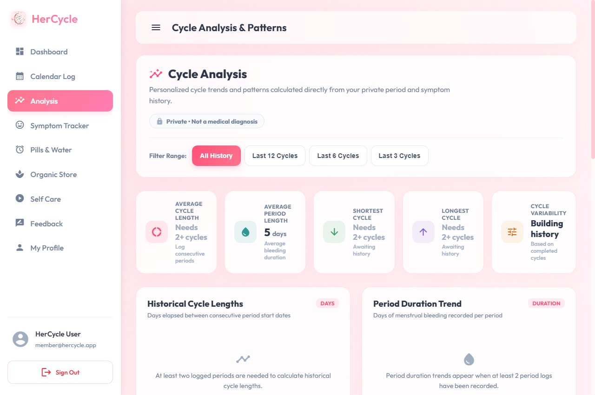
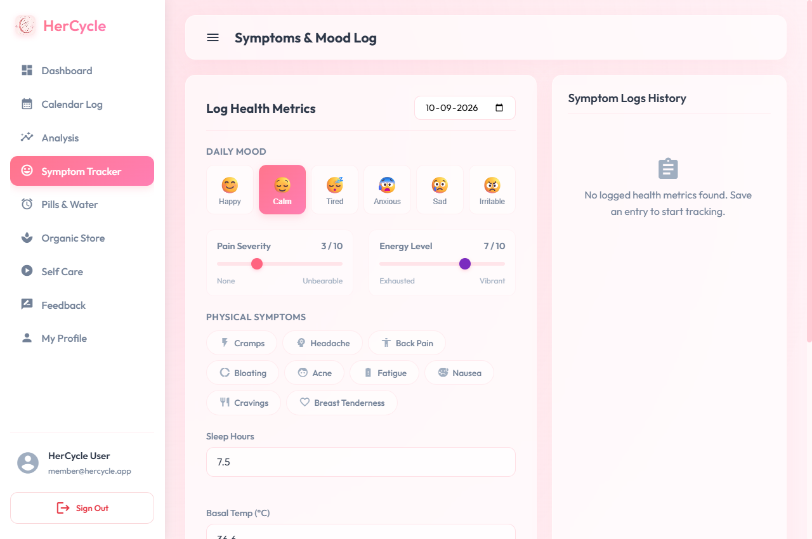
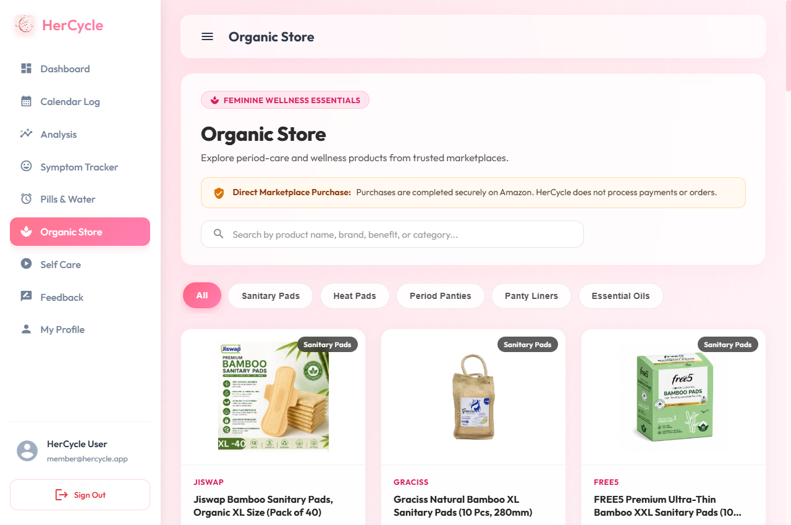
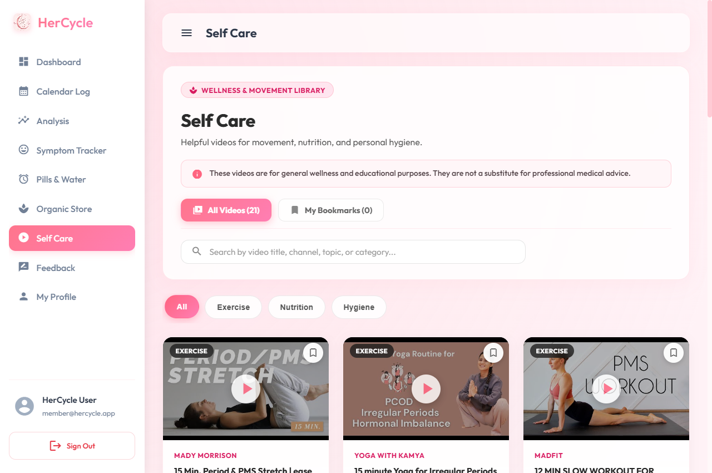
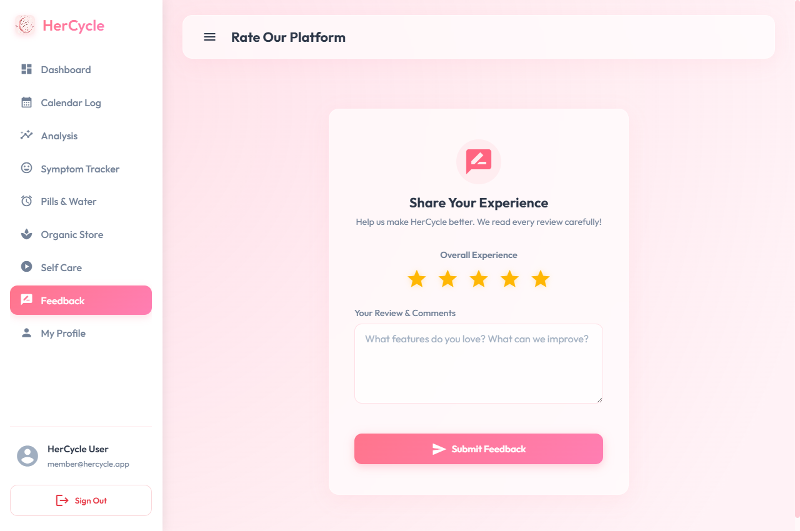
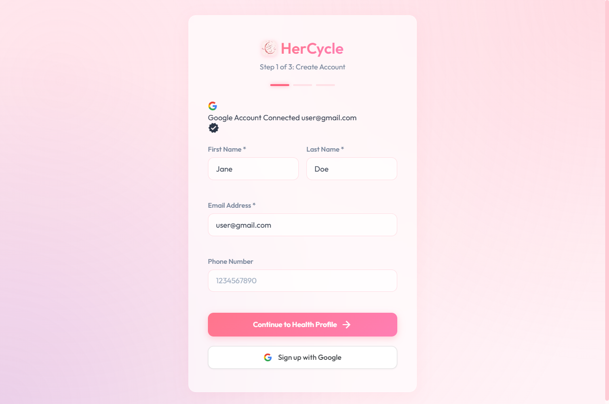
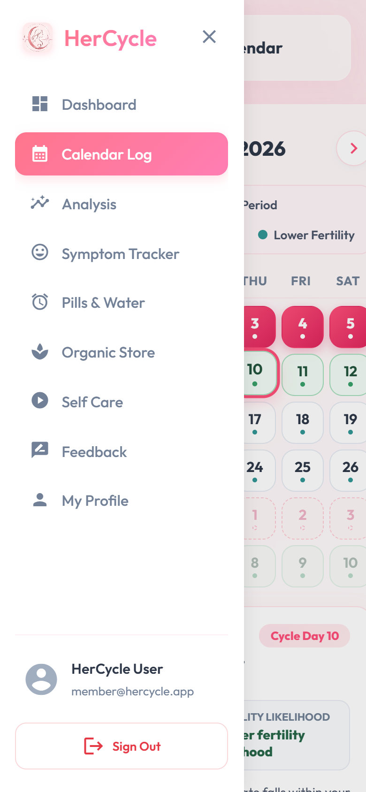
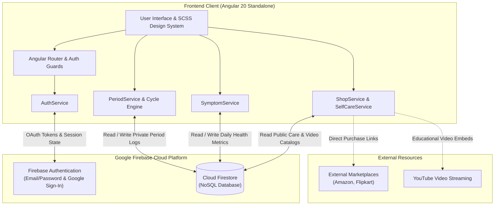

# 🌸 HerCycle

### A personalized menstrual health & wellness tracker

A modern Angular web application designed for tracking menstrual cycles, visualizing cycle patterns, logging daily symptoms and wellness metrics, and discovering curated period-care resources — powered by Firebase.

[](https://hercycle-tracker.vercel.app)
[](https://angular.dev)
[](https://www.typescriptlang.org)
[](https://firebase.google.com)
[](https://firebase.google.com/docs/firestore)
[](https://hercycle-tracker.vercel.app)
[](#-license)

---

## 📖 Table of Contents

1. [Overview](#-overview)
2. [Live Demo](#-live-demo)
3. [Screenshots](#-screenshots)
4. [Key Features](#-key-features)
5. [How HerCycle Works](#-how-hercycle-works)
6. [Technology Stack](#-technology-stack)
7. [Application Architecture & Data Flow](#-application-architecture--data-flow)
8. [Authentication](#-authentication)
9. [Firestore Data Architecture](#-firestore-data-architecture)
10. [Cycle Tracking & Analysis](#-cycle-tracking--analysis)
11. [Self Care](#-self-care)
12. [Wellness / Organic Store](#-wellness--organic-store)
13. [Responsive Design](#-responsive-design)
14. [Getting Started](#-getting-started)
15. [Firebase Configuration](#-firebase-configuration)
16. [Running Locally](#-running-locally)
17. [Production Deployment](#-production-deployment)
18. [Privacy & Security](#-privacy--security)
19. [Important Health Disclaimer](#-important-health-disclaimer)
20. [Project Structure](#-project-structure)
21. [Testing](#-testing)
22. [Future Improvements](#-future-improvements)
23. [License](#-license)
24. [Acknowledgments](#-acknowledgments)

---

## 🌸 Overview

**HerCycle** is a privacy-conscious, client-first web application created to help women track and understand their menstrual health. By combining personal cycle logging with cycle phase calculations and symptom tracking, HerCycle empowers users to stay informed about their reproductive health and daily well-being.

With HerCycle, users can:
- **Create an account** via Email/Password or one-click Google Sign-In.
- **Complete a guided 3-step onboarding flow** covering personal profile details, health baselines, and initial period parameters.
- **Log actual menstrual period start dates and durations** to build an accurate personal cycle history.
- **Navigate an interactive cycle calendar** that displays logged periods, estimated future cycles, estimated fertile windows, ovulation days, and cycle days.
- **Log daily symptoms and health metrics** including mood, pain severity (1–10 scale), energy levels, physical symptoms (cramps, headaches, bloating, etc.), sleep duration, and basal body temperature.
- **Review historical cycle analysis and variability trends** calculated dynamically from the user's recorded periods (with range filtering for 3, 6, 12 cycles, or all history).
- **Access wellness and self-care resources** including guided exercise, nutrition, and hygiene video recommendations.
- **Browse period-care and feminine hygiene products** with direct outbound links to trusted marketplaces.
- **Manage user profile and account preferences** in a protected personal dashboard.

> **Privacy Focus**: User cycle logs, health metrics, and profile data are stored under user-isolated documents in Cloud Firestore and protected by strict Firestore Security Rules.

---

## 🚀 Live Demo

The production application is deployed on Vercel:

🔗 **[https://hercycle-tracker.vercel.app](https://hercycle-tracker.vercel.app)**

- **Hosting Platform**: Vercel
- **Routing**: Single Page Application (SPA) rewrites configured via `frontend/vercel.json`
- **Backend Services**: Firebase Authentication & Cloud Firestore

---

## 📸 Screenshots

### 🌸 Splash Screen
Smooth introductory branding and welcome animation.


---

### 📅 Cycle Calendar
Monthly interactive calendar visualizing logged periods, predicted next periods, estimated ovulation, fertile windows, lower fertility days, and cycle day counts.



---

### 📊 Cycle Analysis
Personalized cycle analytics showing average cycle length, average bleeding duration, shortest and longest cycles, cycle variability, and historical trends across selectable cycle ranges (All History, Last 12 Cycles, Last 6 Cycles, Last 3 Cycles).



---

### 🩷 Symptom & Health Tracking
Daily wellness logging covering mood, pain severity scale, energy level, physical symptoms, sleep hours, and basal body temperature.



---

### 🛍️ Wellness Store
Curated catalog of feminine wellness essentials (bamboo sanitary pads, heat patches, period underwear, panty liners, and essential oils) with direct outbound marketplace purchase links.



---

### 🧘 Self Care
Categorized video library covering menstrual movement, cycle nutrition, and hygiene education. Includes search, category filters, and personal bookmarking.



---

### 💬 Feedback
Interactive platform rating and user feedback form connected to Firestore.



---

### 👤 Google Onboarding
Seamless onboarding for first-time Google Sign-In users, pre-populating verified account details before completing health and period baselines.



---

### 📱 Responsive Navigation
Full mobile navigation drawer optimized for smartphones and tablet viewports.

<p align="center">
  
</p>

---

## ✨ Key Features

### 🩸 Period & Cycle Logging
- **Log Actual Menstrual Periods**: Record exact start dates, end dates, bleeding duration, and flow intensity (Light, Medium, Heavy).
- **Edit & Delete Records**: Update historical period records with automatic recalculation of cycle metrics.
- **Cycle Log History List**: Quick access cards showing recent cycle dates, flow status, and cycle length.

### 📅 Interactive Cycle Calendar
- **Color-Coded Cycle Phases**: Visual markers for Logged Periods, Predicted Periods, Ovulation Day, Fertile Window, and Lower Fertility days.
- **Cycle Day Counter**: Real-time display of current cycle day based on the latest recorded period.
- **Month Navigation**: Browse previous and future months to view past logs and future phase estimates.

### 📈 Cycle Analysis & Statistics
- **Average Cycle Length**: Calculated from consecutive logged period intervals once sufficient history is recorded.
- **Average Period Duration**: Average days of bleeding across logged cycles.
- **Shortest & Longest Cycle**: Identifies cycle range extremes to help understand personal regularity.
- **Cycle Variability Indicator**: Measures consistency across historical cycles.
- **Customizable Range Filters**: Analyze patterns across All History, Last 12 Cycles, Last 6 Cycles, or Last 3 Cycles.

### 😊 Symptom & Mood Tracking
- **Daily Mood**: One-click logging for Happy, Calm, Tired, Anxious, Sad, and Irritable.
- **Pain Severity Slider**: 1–10 visual scale from None to Unbearable.
- **Energy Level Slider**: 1–10 visual scale from Exhausted to Vibrant.
- **Physical Symptom Chips**: Multi-select options for Cramps, Headache, Back Pain, Bloating, Acne, Fatigue, Nausea, Cravings, and Breast Tenderness.
- **Health Metrics**: Daily sleep duration (hours) and Basal Body Temperature (°C).

### 🔐 Authentication & Onboarding
- **Email & Password Authentication**: Full account creation with validation and credential-based sign-in.
- **Google Sign-In**: One-tap sign-in with Google OAuth.
- **Smart Onboarding Flow**:
  - Automatically checks if an authenticated user already has a completed profile document in Firestore.
  - First-time Google users are directed through the 3-step onboarding flow to complete health baselines.
  - Existing registered users are routed directly to the dashboard.
- **Protected Routes**: Angular route guards ensure private dashboard routes are accessible only to authenticated users.

### 🧘 Self-Care & Movement Library
- **Educational Categories**: Exercise, Nutrition, and Hygiene video resources.
- **YouTube Integration**: Direct video playback links for gentle stretching, yoga routines, and wellness advice.
- **Personal Bookmarks**: Save favorite self-care videos to a private collection in Firestore.
- **Search & Filter**: Search videos by title, creator, or topic.

### 🛍️ Wellness & Organic Discovery
- **Feminine Care Catalog**: Browse sanitary pads, organic cotton products, heat patches, period panties, and essential oils.
- **External Marketplace Links**: Products redirect to verified listings on Amazon or other marketplaces.
- *Note: HerCycle does not process payments or store payment information.*

### 👤 Profile & Feedback
- **Profile Management**: View and manage personal health profile baselines.
- **User Feedback**: Submit platform reviews and suggestions directly from the dashboard.

---

## 🔄 How HerCycle Works

```
1. Sign Up / Sign In
   ├── Email & Password registration OR Google Sign-In
   └── First-time users are guided through the 3-Step Setup
       ├── Step 1: Account Details (Name, Contact)
       ├── Step 2: Health Profile (DOB, Height, Weight, Blood Group)
       └── Step 3: Period Setup (Recent Period Start Date, Baseline Cycle Length)
       
2. Data Storage in Cloud Firestore
   └── Private profile created at `users/{uid}` with `profileComplete: true`

3. Dashboard & Calendar Visualization
   ├── Calendar highlights logged period days from Firestore records
   ├── Calculates estimated fertile window (typically cycle days 10–17 for a 28-day baseline)
   ├── Calculates estimated ovulation day (typically ~14 days prior to next estimated start)
   └── Projects upcoming period start dates based on user history

4. Ongoing Daily Tracking
   ├── User logs new periods as they begin and end
   ├── User logs daily mood, pain, symptoms, and basal temperature
   └── Consecutive period entries automatically build historical cycle data

5. Dynamic Cycle Analysis
   ├── Once 2+ consecutive periods are logged, historical cycle lengths are computed
   └── Analytics cards update average length, duration, variability, and trends
```

> **Important Distinction**: All calendar cycle phase markers (predicted periods, fertile window, ovulation) are **mathematical estimates** derived from user-reported cycle lengths and historical logs. They are provided for personal planning and general wellness insight.

---

## 🛠️ Technology Stack

| Layer | Technology | Version | Purpose |
| :--- | :--- | :--- | :--- |
| **Framework** | [Angular](https://angular.dev) | `20.3.26` | Modern standalone component architecture, signals, reactive forms |
| **Language** | [TypeScript](https://www.typescriptlang.org) | `~5.9.2` | Strongly typed frontend logic |
| **UI & Styling** | [SCSS](https://sass-lang.com) + [Angular Material](https://material.angular.io) | `20.2.14` | Custom design system, responsive layouts, Material CDK |
| **Authentication** | [Firebase Authentication](https://firebase.google.com/docs/auth) | `11.10.0` | Email/password auth, Google OAuth provider |
| **Database** | [Cloud Firestore](https://firebase.google.com/docs/firestore) | `11.10.0` | Real-time NoSQL cloud database for user records |
| **Firebase Integration** | [@angular/fire](https://github.com/angular/angularfire) | `20.0.1` | Official Angular integration for Firebase services |
| **Reactive Programming** | [RxJS](https://rxjs.dev) | `~7.8.0` | Asynchronous event streams and auth state management |
| **Testing** | [Karma](https://karma-runner.github.io) + [Jasmine](https://jasmine.github.io) | `6.4.4` / `5.9.0` | Unit test runner and assertion framework |
| **Deployment** | [Vercel](https://vercel.com) | Latest | Global edge hosting with SPA rewrite rules |

---

## 📐 Application Architecture & Data Flow


```mermaid
flowchart TD
    subgraph Client["Frontend Client (Angular 20 Standalone)"]
        UI[User Interface & SCSS Design System]
        Router[Angular Router & Auth Guards]
        AuthSvc[AuthService]
        PeriodSvc[PeriodService & Cycle Engine]
        SymptomSvc[SymptomService]
        ShopSvc[ShopService & SelfCareService]
    end

    subgraph FirebaseServices["Google Firebase Cloud Platform"]
        FirebaseAuth["Firebase Authentication\n(Email/Password & Google Sign-In)"]
        FirestoreDB[("Cloud Firestore\n(NoSQL Database)")]
    end

    subgraph External["External Resources"]
        Marketplaces["External Marketplaces\n(Amazon, Flipkart)"]
        YouTube["YouTube Video Streaming"]
    end

    UI --> Router
    Router --> AuthSvc
    UI --> PeriodSvc
    UI --> SymptomSvc
    UI --> ShopSvc

    AuthSvc <-->|OAuth Tokens & Session State| FirebaseAuth
    PeriodSvc <-->|Read / Write Private Period Logs| FirestoreDB
    SymptomSvc <-->|Read / Write Daily Health Metrics| FirestoreDB
    ShopSvc <-->|Read Public Care & Video Catalogs| FirestoreDB

    ShopSvc -.->|Direct Purchase Links| Marketplaces
    ShopSvc -.->|Educational Video Embeds| YouTube
```

### Architecture Highlights
- **Direct Client-to-Firebase Architecture**: The Angular application interfaces securely with Firebase Authentication and Cloud Firestore via the Firebase Web SDK.
- **Angular Signals & Reactive State**: Utilizes Angular signals for reactive component state, combined with RxJS observables for auth state listening.
- **Granular Security**: Cloud Firestore security rules enforce document-level authorization so authenticated users can only access their own data.

---

## 🔐 Authentication

HerCycle supports two authentication methods:

### 1. Email & Password
- Users register with their name, email, contact number, and password.
- A 3-step onboarding flow collects initial health baselines and recent period dates.
- Returning users sign in directly with their email and password.

### 2. Google Sign-In
- One-click authentication using Google OAuth popup provider (`GoogleAuthProvider`).
- **First-Time Detection**: Upon sign-in, HerCycle queries `users/{uid}` in Firestore. If no document exists, or if `profileComplete` is false, the user is automatically routed to the 3-step onboarding flow with their Google name and email pre-filled.
- **Existing User Routing**: Users who have already completed their profile are immediately redirected to `/dashboard/home`.
- **Protected Routing**: An `AuthGuard` inspects the authentication state on every dashboard navigation, redirecting unauthenticated visitors to `/login`.

---

## 🗄️ Firestore Data Architecture

Cloud Firestore serves as the application's source of truth. Data is organized into user-scoped private collections and shared public collections:

```
firestore-root/
│
├── users/{uid}                               [Private: User profile]
│   ├── firstName: string
│   ├── lastName: string
│   ├── email: string
│   ├── phone: string
│   ├── dateOfBirth: string
│   ├── height: number
│   ├── weight: number
│   ├── bloodGroup: string
│   ├── pregnancyStatus: boolean
│   ├── cycleLength: number
│   ├── periodLength: number
│   ├── profileComplete: boolean
│   │
│   ├── period_logs/{periodId}                [Private: Logged periods]
│   │   ├── startDate: string (YYYY-MM-DD)
│   │   ├── endDate: string (YYYY-MM-DD)
│   │   ├── flow: "LIGHT" | "MEDIUM" | "HEAVY"
│   │   ├── notes: string
│   │   └── createdAt: timestamp
│   │
│   ├── symptoms/{symptomId}                  [Private: Daily symptoms]
│   │   ├── date: string (YYYY-MM-DD)
│   │   ├── mood: string
│   │   ├── painLevel: number (1-10)
│   │   ├── energyLevel: number (1-10)
│   │   ├── symptoms: string[]
│   │   ├── sleepHours: number
│   │   └── basalTemp: number
│   │
│   └── bookmarks/{videoId}                   [Private: Saved videos]
│       └── savedAt: timestamp
│
├── products/{productId}                      [Public: Care catalog]
│   ├── name: string
│   ├── brand: string
│   ├── category: string
│   ├── description: string
│   ├── price: number
│   ├── imageUrl: string
│   └── marketplaceUrl: string
│
├── selfCareVideos/{videoId}                  [Public: Video library]
│   ├── title: string
│   ├── channel: string
│   ├── category: "Exercise" | "Nutrition" | "Hygiene"
│   ├── duration: string
│   └── youtubeUrl: string
│
└── feedback/{feedbackId}                     [Create-Only: Platform reviews]
    ├── userId: string
    ├── rating: number
    ├── comment: string
    └── createdAt: timestamp
```

---

## 📊 Cycle Tracking & Analysis

HerCycle utilizes user-entered period logs as the foundation for all cycle calculations:

1. **Cycle Interval Calculation**: A cycle is measured from the first day of one menstrual period to the first day of the next consecutive menstrual period.
2. **Historical Averages**: When two or more consecutive periods are logged, HerCycle computes:
   - **Average Cycle Length**: Mean days between period start dates.
   - **Average Bleeding Duration**: Mean number of days per bleeding episode.
   - **Cycle Range**: Shortest and longest cycles recorded.
   - **Cycle Variability**: Variance across completed cycles.
3. **Phase Estimation Engine**:
   - **Next Period Prediction**: Projected using the user's computed average cycle length (or default baseline length if history is building).
   - **Estimated Ovulation**: Estimated approximately 14 days before the projected start of the next cycle.
   - **Estimated Fertile Window**: Estimated spanning roughly 5 days prior to ovulation through 1 day post-ovulation.

> ⚠️ **Notice**: Cycle predictions and fertility windows are mathematical estimates and vary with individual physiology, stress, and lifestyle factors. They should **not** be used as a method of contraception or family planning.

---

## 🧘 Self Care

The **Self Care** section provides a curated wellness resource center organized into three core areas:

- **Movement & Exercise**: Gentle yoga routines, pelvic floor stretches, and low-impact workouts designed to ease menstrual cramps and tension.
- **Nutrition**: Food and hydration guidance tailored to different cycle phases (follicular, ovulatory, luteal, menstrual).
- **Personal Hygiene**: Best practices for menstrual cup care, sanitary product usage, and intimate health.

Each resource links directly to YouTube for playback, and users can save videos to their personal **My Bookmarks** collection.

---

## 🛍️ Wellness / Organic Store

The **Organic Store** is a product discovery showcase designed to help users find high-quality menstrual and intimate care products:

- **Categories**: Bamboo sanitary pads, reusable period underwear, soothing heat patches, panty liners, and calming essential oils.
- **Marketplace Redirection**: Product cards feature direct links to trusted external retail marketplaces (such as Amazon and Flipkart).
- **No Internal E-Commerce**: HerCycle does not process transactions, handle checkouts, manage inventory, or collect credit card information.

---

## 📱 Responsive Design

HerCycle is built with a responsive layout designed for seamless tracking across devices:

| Device Type | Viewport Target | Key Adaptations |
| :--- | :--- | :--- |
| **Mobile Phones** | `< 768px` | Collapsible slide-out drawer navigation, touch-friendly calendar cells, stacked analytics cards, full-width symptom sliders. |
| **Tablets** | `768px – 1024px` | Adaptive two-column dashboard, flexible grid cards, compact calendar view. |
| **Desktops & Laptops** | `> 1024px` | Fixed sidebar navigation, side-by-side calendar and cycle insights panel, expanded analysis charts and filters. |

---

## 🚀 Getting Started

### Prerequisites

Ensure you have the following installed on your machine:
- **Node.js**: `v18.x` or `v20.x` (or newer LTS)
- **npm**: `v9.x` or newer
- **Angular CLI** (optional, for global `ng` commands):
  ```bash
  npm install -g @angular/cli
  ```

### 1. Clone the Repository

```bash
git clone https://github.com/HerCycle/herCycleTracker.git
cd herCycleTracker
```

### 2. Install Dependencies

Navigate to the `frontend/` directory and install packages:

```bash
cd frontend
npm install
```

---

## ⚙️ Firebase Configuration

HerCycle requires a Firebase project with **Firebase Authentication** and **Cloud Firestore** enabled.

### 1. Create a Firebase Project
1. Go to the [Firebase Console](https://console.firebase.google.com/).
2. Create a new project (e.g., `hercycle-tracker`).
3. Under **Build > Authentication**, enable:
   - **Email/Password** provider
   - **Google** provider
4. Under **Build > Firestore Database**, create a database in your preferred region.

### 2. Configure Environment Files
In `frontend/src/environments/`, set up your Firebase web credentials:

**`frontend/src/environments/environment.ts`** (Development):
```typescript
export const environment = {
  production: false,
  firebase: {
    apiKey: "YOUR_API_KEY",
    authDomain: "YOUR_PROJECT_ID.firebaseapp.com",
    projectId: "YOUR_PROJECT_ID",
    storageBucket: "YOUR_PROJECT_ID.appspot.com",
    messagingSenderId: "YOUR_MESSAGING_SENDER_ID",
    appId: "YOUR_APP_ID"
  }
};
```

**`frontend/src/environments/environment.prod.ts`** (Production):
```typescript
export const environment = {
  production: true,
  firebase: {
    apiKey: "YOUR_API_KEY",
    authDomain: "YOUR_PROJECT_ID.firebaseapp.com",
    projectId: "YOUR_PROJECT_ID",
    storageBucket: "YOUR_PROJECT_ID.appspot.com",
    messagingSenderId: "YOUR_MESSAGING_SENDER_ID",
    appId: "YOUR_APP_ID"
  }
};
```

> **Note**: Firebase client configuration values (API key, Project ID) identify your Firebase project to Google client libraries and are intended for public client use. Data security is enforced by **Cloud Firestore Security Rules**.

### 3. Deploy Firestore Security Rules
Deploy the security rules located in `firestore.rules` at the project root:

```bash
firebase deploy --only firestore:rules
```

---

## 💻 Running Locally

To start the local Angular development server:

```bash
cd frontend
npm start
```

Once compilation completes, open your browser and navigate to:

```
http://localhost:4200
```

The application will automatically reload when source files are modified.

---

## 🌐 Production Deployment

The project is configured for deployment on **Vercel**.

### Vercel SPA Routing
Angular uses client-side routing. To ensure direct URL visits and page reloads work correctly, `frontend/vercel.json` provides rewrite configuration:

```json
{
  "$schema": "https://openapi.vercel.sh/vercel.json",
  "rewrites": [
    {
      "source": "/(.*)",
      "destination": "/index.html"
    }
  ]
}
```

### Production Build
To create an optimized production bundle:

```bash
cd frontend
npm run build
```

The compiled output will be generated in `frontend/dist/frontend/browser/`.

---

## 🔒 Privacy & Security

Menstrual and reproductive health data is deeply personal. HerCycle is designed with the following security principles:

1. **User Isolation**: Firestore documents under `users/{uid}` and subcollections (`period_logs`, `symptoms`, `reminders`, `bookmarks`) are accessible only by the authenticated user whose `request.auth.uid` matches the document path.
2. **Access Control**:
   ```javascript
   match /users/{uid} {
     allow read, write: if request.auth != null && request.auth.uid == uid;
     
     match /{allSubcollections=**} {
       allow read, write: if request.auth != null && request.auth.uid == uid;
     }
   }
   ```
3. **Public Read-Only Catalogs**: Shared catalogs (`products`, `selfCareVideos`) are configured as read-only for clients (`allow write: if false;`).
4. **No Third-Party Analytics Trackers**: User menstrual data is stored in the user's private database and is never shared with third-party advertisers.
5. **No Payment Data Collected**: By redirecting to external marketplaces, HerCycle avoids holding payment card data or financial information.

---

## ⚠️ Important Health Disclaimer

> ### **Health & Medical Notice**
> 
> **HerCycle is intended solely for personal tracking, wellness, and educational purposes.**
> 
> - The cycle predictions, ovulation dates, and fertile window estimations displayed by HerCycle are **mathematical approximations** based on user-entered historical data and standard hormonal cycle models.
> - **They are not medical diagnoses, professional medical advice, or fertility guarantees.**
> - **HerCycle must NOT be used as a method of contraception or family planning.**
> - Always consult a qualified healthcare professional, gynecologist, or physician for any medical concerns, abnormal symptoms, irregular cycles, or questions regarding reproductive health.

---

## 📁 Project Structure

```
herCycleTracker/
├── docs/
│   └── screenshots/                   # Repository screenshots for documentation
│       ├── splash-screen.png
│       ├── cycle-calendar.png
│       ├── cycle-analysis.png
│       ├── symptom-tracker.png
│       ├── organic-store.png
│       ├── self-care.png
│       ├── feedback.png
│       ├── google-onboarding.png
│       └── mobile-navigation.png
│
├── frontend/                          # Angular 20 Frontend Application
│   ├── src/
│   │   ├── app/
│   │   │   ├── guards/                # Route authorization guards (AuthGuard)
│   │   │   ├── models/                # TypeScript interfaces (User, PeriodLog, etc.)
│   │   │   ├── pages/
│   │   │   │   ├── auth/              # Login, Registration & Onboarding
│   │   │   │   ├── dashboard/         # Dashboard layout, Calendar, Analysis, Symptoms,
│   │   │   │   │                      # Self Care, Shop, Feedback, Profile
│   │   │   │   └── home/              # Welcome / landing page
│   │   │   └── services/              # AuthService, PeriodService, SymptomService, etc.
│   │   ├── assets/                    # Static images and icons
│   │   ├── environments/              # Firebase environment configuration
│   │   ├── styles.scss                # Global SCSS stylesheet and theme variables
│   │   └── main.ts                    # Application bootstrap entry point
│   ├── angular.json                   # Angular CLI configuration
│   ├── package.json                   # Frontend dependencies and npm scripts
│   ├── tsconfig.json                  # TypeScript configuration
│   └── vercel.json                    # Vercel SPA routing rewrites
│
├── scripts/                           # Firestore seed utilities
│   ├── seed-firestore.mjs
│   ├── seed-products.json
│   └── seed-self-care-videos.json
│
├── .firebaserc                        # Firebase project aliases
├── firebase.json                      # Firebase configuration
├── firestore.rules                    # Cloud Firestore security rules
└── README.md                          # Project documentation
```

---

## 🧪 Testing

HerCycle includes automated unit tests for Angular components and services using **Jasmine** and the **Karma** test runner.

To run the unit test suite:

```bash
cd frontend
npm test
```

To run tests once in a headless environment (ideal for CI/CD pipelines):

```bash
cd frontend
npx ng test --watch=false --browsers=ChromeHeadless
```

---

## 🔮 Future Improvements

Potential enhancements planned for future releases:
- [ ] **Symptom Correlation Trends**: Visual graphs linking specific symptoms (e.g., mood, cramps) to cycle phases.
- [ ] **Exportable Cycle Reports**: Export menstrual history and cycle statistics as PDF reports for healthcare provider visits.
- [ ] **Custom Reminders**: Optional browser push notifications for upcoming periods and hydration logging.
- [ ] **Dark Mode Theme**: Alternative theme support for low-light environments.
- [ ] **Offline PWA Support**: Progressive Web App capabilities for local caching and offline log entry.

---

## 📄 License

License information has not yet been specified.

---

## 💖 Acknowledgments

- Built with [Angular](https://angular.dev)
- Powered by [Google Firebase](https://firebase.google.com)
- Deployed on [Vercel](https://vercel.com)
- Icons provided by [Google Material Symbols & Icons](https://fonts.google.com/icons)
