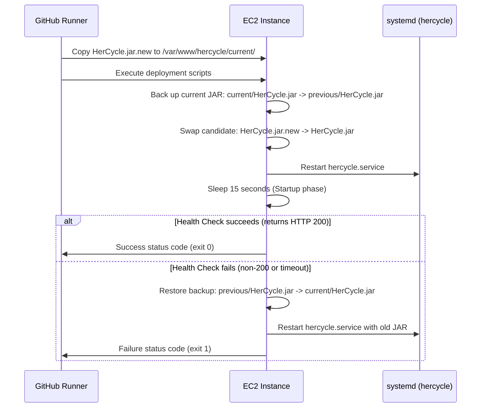

# GitHub Actions CI/CD Pipeline Summary

This document describes the automated deployment workflow, required repository secrets, execution trigger mechanisms, and the rollback safety controls implemented for HerCycle.

---

## 1. Workflow Pipeline Design

The CI/CD pipeline is defined in [deploy.yml](file:///c:/Users/vasav/OneDrive/Desktop/Her_Cycle/Backend/.github/workflows/deploy.yml). The workflow triggers automatically whenever new commits are pushed to the `main` branch.

The pipeline comprises two distinct jobs:
1. **Build Job**: Checkout code, set up Java (JDK 21), and compile the application via Maven into a runnable jar. Upload the compiled jar file as a workflow artifact.
2. **Deploy Job**: Download the compiled jar, install SSH keys, connect to the EC2 server, copy the artifact to the remote server, and run a deployment script with automatic health check validation.

---

## 2. Automated Rollback Protocol

To maintain high availability and prevent broken builds from crashing the production application, the deploy step implements a self-healing rollback mechanism:

---

## 3. Required GitHub Repository Secrets

You must configure the following repository secrets to enable deployment access:

| Secret Name | Value | Description |
| :--- | :--- | :--- |
| `SSH_HOST` | `52.2.37.31` | The public Elastic IP address of the EC2 instance. |
| `SSH_USER` | `ubuntu` | The default SSH deployment username. |
| `SSH_PRIVATE_KEY` | *(Content of key)* | The complete content of the private SSH key file (`HerCycle-Key.pem`). |

### How to configure:
1. Open your repository on GitHub.
2. Navigate to **Settings** -> **Secrets and variables** -> **Actions**.
3. Click **New repository secret**.
4. Input the name and corresponding value, then click **Add secret**.

---

## 4. Triggering the Workflow

1. **Automatic Trigger**: Any git push or merged pull request targeting the `main` branch will automatically launch a run of this pipeline.
2. **Manual Trigger**: If manual execution is desired, you can add the `workflow_dispatch:` trigger to the `on:` configuration in the YAML file. This exposes a "Run workflow" button in the Actions tab of the GitHub repository interface.
