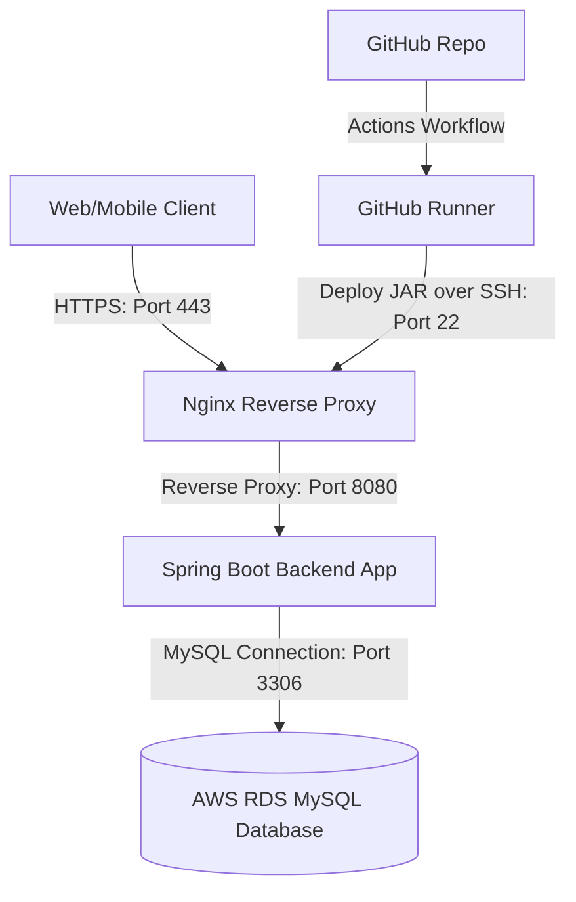

# HerCycle Deployment & Infrastructure Summary

This document provides a summary of the production environment architecture and cloud infrastructure configured for the HerCycle backend application.

---

## 1. System Overview

HerCycle is a Women's Health and Menstrual Cycle Tracking system. The backend is built using the Spring Boot framework (Java 21) and communicates with an external MySQL database hosted on AWS RDS. Public traffic is secured over HTTPS (Port 443) and proxied through Nginx.

### Architecture Topology

---

## 2. Infrastructure Specs

| Component | AWS Resource | Details / Specifications |
| :--- | :--- | :--- |
| **Compute Node** | EC2 Instance | **Type**: t3.medium or equivalent (2 vCPUs, 2 GiB RAM, 20 GiB SSD Storage) **OS**: Ubuntu Server 26.04 LTS **Elastic IP**: `52.2.37.31` |
| **Database Engine** | RDS Database | **Engine**: MySQL 8.x **Endpoint**: `hercycle.cczkqckgorra.us-east-1.rds.amazonaws.com` **Port**: `3306` |
| **Firewall / Network** | Security Groups / UFW | **UFW**: Active on compute instance. Port 22 (SSH), 80 (HTTP), and 443 (HTTPS) allowed. **Security Groups**: Inbound rules aligned with UFW. |
| **Build System** | GitHub Actions | **Runner**: `ubuntu-latest` container **Tools**: JDK 21, Maven 3.9.x |
